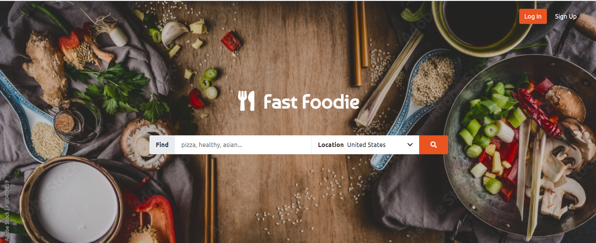
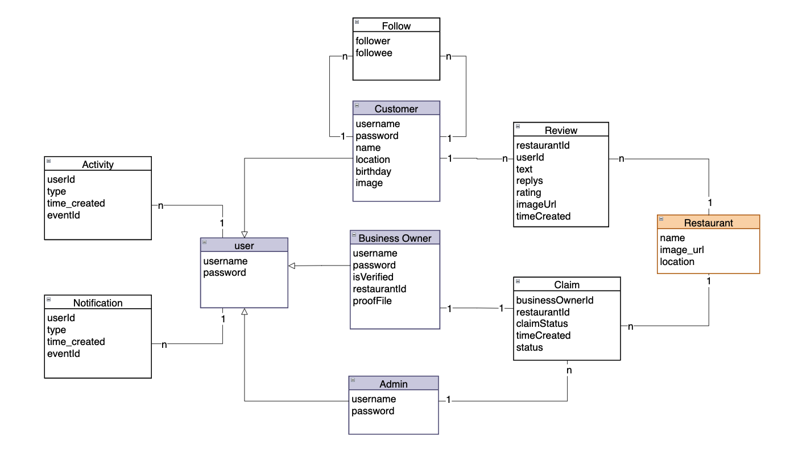

# Fast Foodie

 

## About the project
This is a React application for fast-foodie project.

### Project basic functionalities
- Login, register
- Search restaurant
- CRUD reviews
- View profile
- Follow other users
- Dynamic contents: 
  - Notifications
  - Activities

### Server end
Please see the server end of this application on [Github](https://github.com/maimanger/fast-foodie-server.git)
 
 

### Built with
- HTML
- CSS
- JavaScript
- Bootstrap
- FontAwesome
- React
- Node.js
- Express.js
- MongoDB
- Mongoose

### Remote Api
The project leverages [Yelp Fusion API](https://fusion.yelp.com/) and [Documenu API](https://documenu.com/).
 
 
 

## Getting Started
 

### Pages
- Home
- Search
- Detail
- Profile: public/private
- Login
- Register
- Business claim
- Privacy policy
 

### 3 user roles
* **Anonymous user**
    - Search restaurants
    - See details of a restaurant: open time, address, map, menu...
    - See reviews of a restaurant left by other users
    - See profiles of other users
    - See generic recent activities
1. **Customer user**
    - Search restaurants
    - CRUD his/her reviews for a restaurant
    - Follow other customer users
    - Get notification reminders
    - Own a private profile which displays the user's activities
    - Browse activities of nearby restaurant and the user's followings
2. **Business owner**
    - Claim a business
    - Reply reviews from customers
3. **Admin**
    - Verify business owner's identity, and accordingly accept or decline his/her claim request.
 

### Data models
- Domain object models
  - Follow
  - Review
  - Claim
  - Activity
  - Notification
  - Restaurant
- User models
  - Customer
  - BusinessOwner
  - Admin
  
 
### Data model relations
- One to one
  - BusinessOwner and Restaurant (claim)
- One to many
  - User and Notification/Activity
  - Restaurant and BusinessOwner
  - Admin and BusinessOwner
- Many to many
  - Customer and Customer (follow)
  - Customer and Restaurant (review)
 
 

### Contributors
- Qiansha Meng
- Fangying Li
- Zihan Wang
 
 

Hope you like this content :thumbsup:
